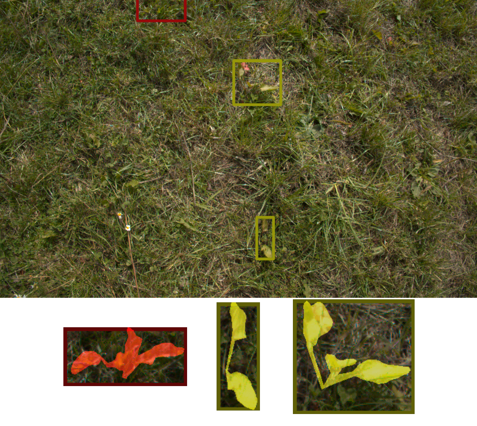
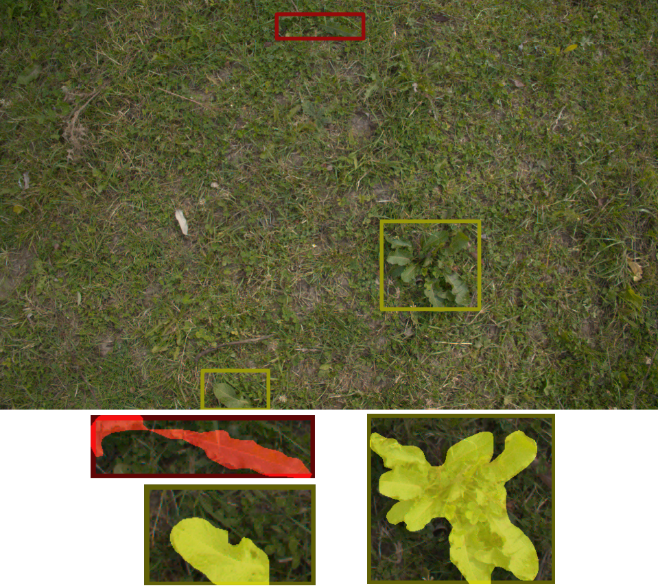
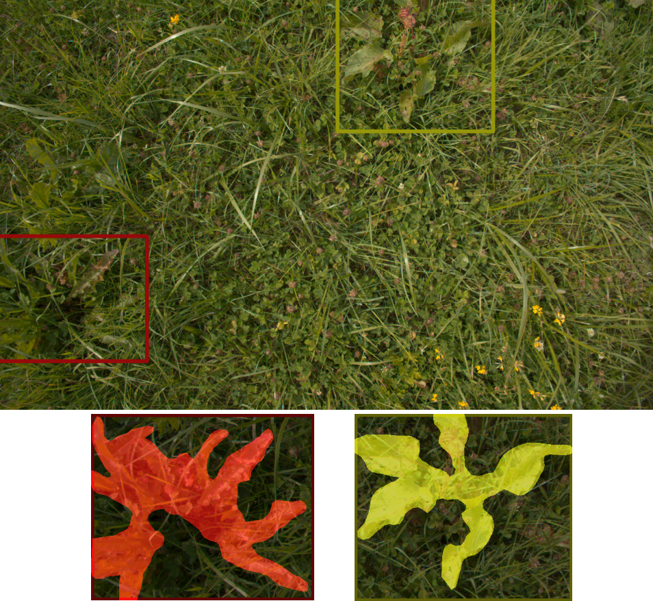
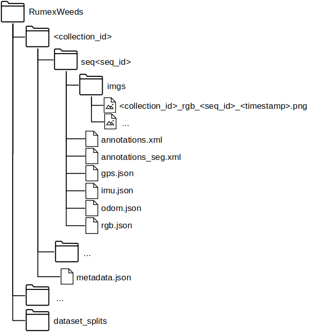
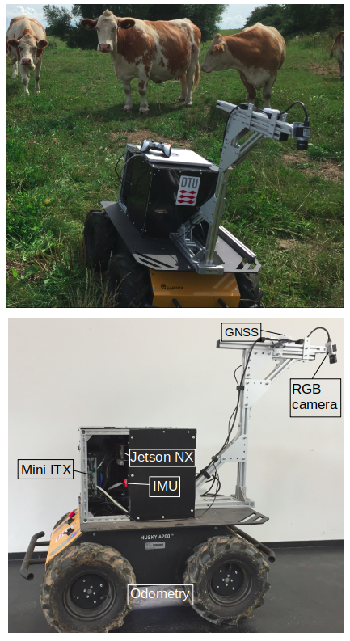
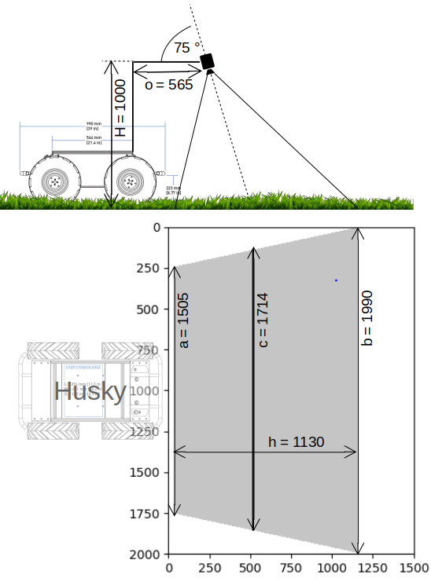

# RumexWeeds: A Grassland Dataset for Agricultural Robotics.
PDF: [ToDo](https://github.com/RGring/RumexWeeds)

Abstract:
Computer vision can lead towards more sustainable agricultural production by enabling robotic precision agriculture. Vision-equipped robots are being deployed in the fields to handle crops and control weeds. However, publicly available agricultural datasets containing both image data as well as data from additional navigational robot sensors are scarce.
Our real-world dataset RumexWeeds targets the detection of the grassland weeds: _Rumex obtusifolius L._ and _Rumex crispus L._. RumexWeeds includes whole image sequences instead of individual static images, which is rare for computer vision image datasets yet crucial for robotic applications. It allows for more robust object detection, incorporating temporal aspects and considering different viewpoints of the same object. Furthermore, RumexWeeds includes data from additional navigational robot sensors---GNSS, IMU and odometry---which can increase robustness, when additionally fed to detection models. In total the dataset includes 5,510 images with 15,519 manual bounding box annotations collected at 3 different farms and 4 different days in summer and autumn 2021. Additionally, RumexWeeds includes a subset of 340 ground truth pixels-wise annotations, which are further used to generate segmentation masks for the remaining bounding boxes automatically. The dataset is publicly available at [ToDo](https://github.com/RGring/RumexWeeds).


## Example Images
<p float="left">
  
</p>
<p float="left">
   
</p>
<p float="left">
   
</p>


## File Structure
RumexWeeds contains 5 subfolders---one for each dataset collection session. Each dataset collection contains an arbitrary number of sequences, while each sequence consists of a number of consecutive images at 5 FPS. The corresponding datapoints of IMU, GNSS and Odometry are saved as dictionary in the _seq< seq_id >/*.json_ files. We simply save the corresponding ROS message as dictionary, which is _sensor_msgs/NavSatFix.msg_ for the GNSS, _sensor_msgs/Imu.msg_ for the IMU and _nav_msgs/Odometry.msg_ for the Odometry data. The images and the navigational data are linked via the image file name, which serves as key in the json-dictionary. In other words all sensor points with the same key are time-synchronized. The file _seq< seq_id >/rgb.json_ simply contains the timestamp in the standard timestamp format and is therefore redundant with the timestamp information embedded in the image name. The _seq< seq_id >/annotations.xml_ contains all ground truth (i.e. performed by a human) bounding box and segmentation annotations for the corresponding image sequence. Supplementary, the _seq< seq_id >/annotations_seg.xml_ contains all automatically generated pixel-wise annotations. The format of the annotations follows the conventions of the CVAT annotation tool version 1.1. Finally, the _metadata.json_: includes information concerning all sequences within one data collection _< collection_id >_. It contains transforms from base_link to the three sensors: → camera_link, → imu_link, → base_gnss as well as the transform base_footprint → base_link. The base_footprint-frame is positioned on the ground, while the base_link-frame lays within the robot, therefore giving insight on the robot height above ground. The folder _dataset\_splits_ contains dataset splits in order to compare ones results to each other in future works.



## The Agricultural Robot Platform
<p float="left">
  
   
</p>

## Getting Started in Pytorch
ToDo

<!-- ## Citation

If you find this work useful in your research, please cite:
```
@article{RumexWeeds2021,
  title={RumexWeeds: A Grassland Dataset for Agricultural Robotics.},
  author={Güldenring, Ronja and Evert van, Frits and Nalpantidis, Lazaros},
  booktitle={TBA},
  year={2021}
}
``` -->