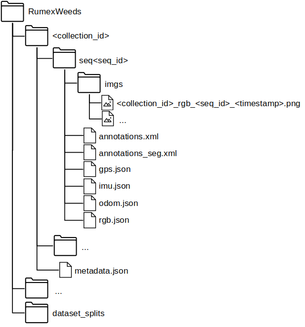

# RumexWeeds: A Grassland Dataset for Agricultural Robotics.
Paper: [ToDo](https://github.com/RGring/RumexWeeds)

Abstract:
Computer vision can lead towards more sustainable agricultural production by enabling robotic precision agriculture. Vision-equipped robots are being deployed in the fields to handle crops and control weeds. However, publicly available agricultural datasets containing both image data as well as data from additional navigational robot sensors are scarce.
Our real-world dataset RumexWeeds targets the detection of the grassland weeds: _Rumex obtusifolius L._ and _Rumex crispus L._. RumexWeeds includes whole image sequences instead of individual static images, which is rare for computer vision image datasets yet crucial for robotic applications. It allows for more robust object detection, incorporating temporal aspects and considering different viewpoints of the same object. Furthermore, RumexWeeds includes data from additional navigational robot sensors---GNSS, IMU and odometry---which can increase robustness, when additionally fed to detection models. In total the dataset includes 5,510 images with 15,519 manual bounding box annotations collected at 3 different farms and 4 different days in summer and autumn 2021. Additionally, RumexWeeds includes a subset of 340 ground truth pixels-wise annotations. The dataset is publicly available at [ToDo](https://rgring.github.io/RumexWeeds/).


## Example Sequences
### 20210806_hegnstrup - Sequence 17
<iframe width="960" height="600" src="https://www.youtube.com/embed/3WoM9ILuoJ8" frameborder="0" allowfullscreen></iframe>

### 20210806_stengard - Sequence 8
<iframe width="960" height="600" src="https://www.youtube.com/embed/X7Oi9enc7xc" frameborder="0" allowfullscreen></iframe>

### 20210807_lundholm - Sequence 23
<iframe width="960" height="600" src="https://www.youtube.com/embed/7OSrtETfVYw" frameborder="0" allowfullscreen></iframe>

## Image Annotations
### Ground truth annotations
For all labeled image sequences, bounding box annotations are generated manually for the grassland weed Rumex. Each bounding box includes the whole plant with all attached leaves. If the plant consists of only one leaf, the single leaf is enclosed by a bounding box. On very dense weed images, it can be difficult to identify all plants with high certainty. Here, noisy labels can be expected.e differentiate between the two relevant sub-species *Rumex obtusifolius L.* and *Rumex crispus L.* and assign the relevant class to each bounding box. Both sub-species are equally undesired on dairy grassland fields and therefore, for most application it stands to reason to treat both species as one class. The decision for one of the above-mentioned classes was made purely based on the visual appearance in the images. Additionally, we provide a small number of carefully manually-annotated ground truth masks for a random subset of 20 images per location and day, resulting in 100 images and 340 segmented bounding box crops in total.

The following table summarizes the datapoints that have been collected and annotated on four different days and at three different farms. We show the number of foreground images -- including one or more Rumex objects --, the number of pure background images, the total number of annotations for both classes (*Rumex obtusifolius L.*, *Rumex crispus L.*), the total proportion of positive pixels vs all image pixels, as well as the average bounding box size as a percentage of the whole image size. Although we have a significantly higher number of foreground images containing at least one object, the Rumex plant is still highly under-represented when considering the positive pixel proportion for each data collection session. Moreover, it lists the exact number of pixel-wise annotations for both object classes and each data collection session.

<style type="text/css">
.tg  {border-collapse:collapse;border-spacing:0;}
.tg td{border-color:black;border-style:solid;border-width:1px;font-family:Arial, sans-serif;font-size:14px;
  overflow:hidden;padding:10px 5px;word-break:normal;}
.tg th{border-color:black;border-style:solid;border-width:1px;font-family:Arial, sans-serif;font-size:14px;
  font-weight:normal;overflow:hidden;padding:10px 5px;word-break:normal;}
.tg .tg-c3ow{border-color:inherit;text-align:center;vertical-align:top}
.tg .tg-0pky{border-color:inherit;text-align:left;vertical-align:top}
</style>
<table class="tg">
<thead>
  <tr>
    <th class="tg-0pky"></th>
    <th class="tg-c3ow">ID</th>
    <th class="tg-c3ow">20210806_hegnstrup</th>
    <th class="tg-c3ow">20210806_stengard</th>
    <th class="tg-c3ow">20211006_stengard</th>
    <th class="tg-c3ow">20210807_lundholm</th>
    <th class="tg-c3ow">20210908_lundholm</th>
  </tr>
</thead>
<tbody>
  <tr>
    <td class="tg-c3ow" rowspan="6">General</td>
    <td class="tg-c3ow">Date</td>
    <td class="tg-c3ow" colspan="2">Aug. 06, 2021</td>
    <td class="tg-c3ow">Oct. 11, 2021</td>
    <td class="tg-c3ow">Aug. 7, 2021</td>
    <td class="tg-c3ow">Sep. 8, 2021</td>
  </tr>
  <tr>
    <td class="tg-c3ow">Farm Name</td>
    <td class="tg-c3ow">Hegnstrup</td>
    <td class="tg-c3ow" colspan="2">Stengard</td>
    <td class="tg-c3ow" colspan="2">Lundholm</td>
  </tr>
  <tr>
    <td class="tg-c3ow">Location</td>
    <td class="tg-c3ow">55°50'12.5"N <br>12°22'57.8"E</td>
    <td class="tg-c3ow" colspan="2">55°50'24.5"N <br>12°12'46.8"E</td>
    <td class="tg-c3ow" colspan="2">55°56'36.7"N <br>12°10'09.0"E</td>
  </tr>
  <tr>
    <td class="tg-c3ow"># sequences</td>
    <td class="tg-c3ow">18</td>
    <td class="tg-c3ow">21</td>
    <td class="tg-c3ow">16</td>
    <td class="tg-c3ow">29</td>
    <td class="tg-c3ow">14</td>
  </tr>
  <tr>
    <td class="tg-c3ow"># FG images</td>
    <td class="tg-c3ow">454</td>
    <td class="tg-c3ow">1459</td>
    <td class="tg-c3ow">1207</td>
    <td class="tg-c3ow">786</td>
    <td class="tg-c3ow">962</td>
  </tr>
  <tr>
    <td class="tg-c3ow"># BG images</td>
    <td class="tg-c3ow">126</td>
    <td class="tg-c3ow">75</td>
    <td class="tg-c3ow">61</td>
    <td class="tg-c3ow">342</td>
    <td class="tg-c3ow">38</td>
  </tr>
  <tr>
    <td class="tg-0pky" rowspan="4">Bounding<br>Box<br>Annotation<br></td>
    <td class="tg-c3ow"># Rumex <br>obtusifolius<br></td>
    <td class="tg-c3ow">563</td>
    <td class="tg-c3ow">3653</td>
    <td class="tg-c3ow">4358</td>
    <td class="tg-c3ow">774</td>
    <td class="tg-c3ow">3208</td>
  </tr>
  <tr>
    <td class="tg-c3ow"># Rumex crispus</td>
    <td class="tg-c3ow">89</td>
    <td class="tg-c3ow">1296</td>
    <td class="tg-c3ow">1142</td>
    <td class="tg-c3ow">264</td>
    <td class="tg-c3ow">172</td>
  </tr>
  <tr>
    <td class="tg-0pky">pos. <br>pixel proportion</td>
    <td class="tg-0pky">7.57 %</td>
    <td class="tg-0pky">5.66 %</td>
    <td class="tg-0pky">6.22 %</td>
    <td class="tg-0pky">4.11 %</td>
    <td class="tg-0pky">12.90 %</td>
  </tr>
  <tr>
    <td class="tg-0pky">avg.<br>object size<br></td>
    <td class="tg-0pky">6.74 %</td>
    <td class="tg-0pky">1.75 %</td>
    <td class="tg-0pky">1.44 %</td>
    <td class="tg-0pky">4.47 %</td>
    <td class="tg-0pky">3.82 %</td>
  </tr>
  <tr>
    <td class="tg-0pky" rowspan="2">Pixel-wise<br>Annotation<br></td>
    <td class="tg-0pky"># Rumex<br>obtusifolius<br></td>
    <td class="tg-0pky">23</td>
    <td class="tg-0pky">66</td>
    <td class="tg-0pky">92</td>
    <td class="tg-0pky">17</td>
    <td class="tg-0pky">71</td>
  </tr>
  <tr>
    <td class="tg-0pky"># Rumex crispus</td>
    <td class="tg-0pky">3</td>
    <td class="tg-0pky">16</td>
    <td class="tg-0pky">41</td>
    <td class="tg-0pky">7</td>
    <td class="tg-0pky">4<br></td>
  </tr>
</tbody>
</table>

### Automatic generation pixel-wise annotations for the remaining bounding boxes.
Bounding Box annotations provide a rough position of the weed plant in the image. For some applications, weed segmentation is crucial in order to estimate a more precise plant size and position. Unfortunately, manual pixel-wise object annotations are especially expensive to obtain for large amounts of training data. Therefore, we generated additional segmentation masks automatically, based on a very small amount of carefully manually-annotated ground truth masks. We hypothesise, that these few ground truth segmentation masks are sufficient to generate rough masks for the remaining bounding boxes in the dataset. Performing segmentation predictions for bounding box crops simplifies the problem to a great extent, because we only need to differentiate between foreground and background, while the foreground mask inherits the label of the bounding box. Furthermore, it is generally expected that no other negative plant objects with similar features (e.g. *Taraxacum*, *Cirsium*) lay within the bounding box crops. The manually segmented bounding box crops are used to train a segmentation network and generate segmentation masks for all remaining bounding box crops.

As network architecture, we used the CNN segmentation architecture U-Net \cite{unet} with an Encoder-Decoder structure. We apply transfer-learning to the model encoder *ResNet-34* \cite{DBLP:journals/corr/HeZRS15} by loading pre-trained ImageNet \cite{deng2009imagenet} weights. The network is updated using the Adam Optimizer \cite{Kingma2015AdamAM} with a learning rate of \(lr_{enc} = lr_{dec} = 0.001\) as well as the Lovasz Loss \cite{lovasz_loss} for 80 epochs. Furthermore, we apply cosine learning rate scheduling \cite{cosine_lr_schedule}. The input bounding box crops are resized to an image size of \([512 \times 512]\) and standard image augmentation such as random flipping, random rotation and random scaling are applied. As performance measurement, we consider the *mean Intersection over Union (mIoU)*.

The final model achieves an __mIoU of 0.776__ on the test--set, which corresponds to 20% of randomly sampled pixel-wise annotated bounding box crops. In the following figure, we show some qualitative results of the test--set with ground truth masks in the top row and model predictions in the bottom row. The majority of segmentation masks are precise enough in order to determine an approximate plant size as well as the center location of the plant. When the plant leaves are thin and resemble grass structure, the predictions are less reliable, which mainly occurs for the species *Rumex crispus L.*.
<p float="left">
  
</p>


## File Structure of .zip
RumexWeeds contains 5 subfolders---one for each dataset collection session. Each dataset collection contains an arbitrary number of sequences, while each sequence consists of a number of consecutive images at 5 FPS. The corresponding datapoints of IMU, GNSS and Odometry are saved as dictionary in the _seq< seq_id >/*.json_ files. We simply save the corresponding ROS message as dictionary, which is _sensor_msgs/NavSatFix.msg_ for the GNSS, _sensor_msgs/Imu.msg_ for the IMU and _nav_msgs/Odometry.msg_ for the Odometry data. The images and the navigational data are linked via the image file name, which serves as key in the json-dictionary. In other words all sensor points with the same key are time-synchronized. The file _seq< seq_id >/rgb.json_ simply contains the timestamp in the standard timestamp format and is therefore redundant with the timestamp information embedded in the image name. The _seq< seq_id >/annotations.xml_ contains all ground truth (i.e. performed by a human) bounding box and segmentation annotations for the corresponding image sequence. Supplementary, the _seq< seq_id >/annotations_seg.xml_ contains all automatically generated pixel-wise annotations. The format of the annotations follows the conventions of the CVAT annotation tool version 1.1. Finally, the _metadata.json_: includes information concerning all sequences within one data collection _< collection_id >_. It contains transforms from base_link to the three sensors: → camera_link, → imu_link, → base_gnss as well as the transform base_footprint → base_link. The base_footprint-frame is positioned on the ground, while the base_link-frame lays within the robot, therefore giving insight on the robot height above ground. The folder _dataset\_splits_ contains dataset splits in order to compare ones results to each other in future works.



<!-- ### The Agricultural Robot Platform
<p float="left">
  
   
</p> -->

## Getting Started in Pytorch
ToDo

## Citation

If you find this work useful in your research, please cite:
```
@article{RumexWeeds2021,
  title={RumexWeeds: A Grassland Dataset for Agricultural Robotics.},
  author={Güldenring, Ronja and Evert van, Frits and Nalpantidis, Lazaros},
  booktitle={TBA},
  year={2021}
}
```